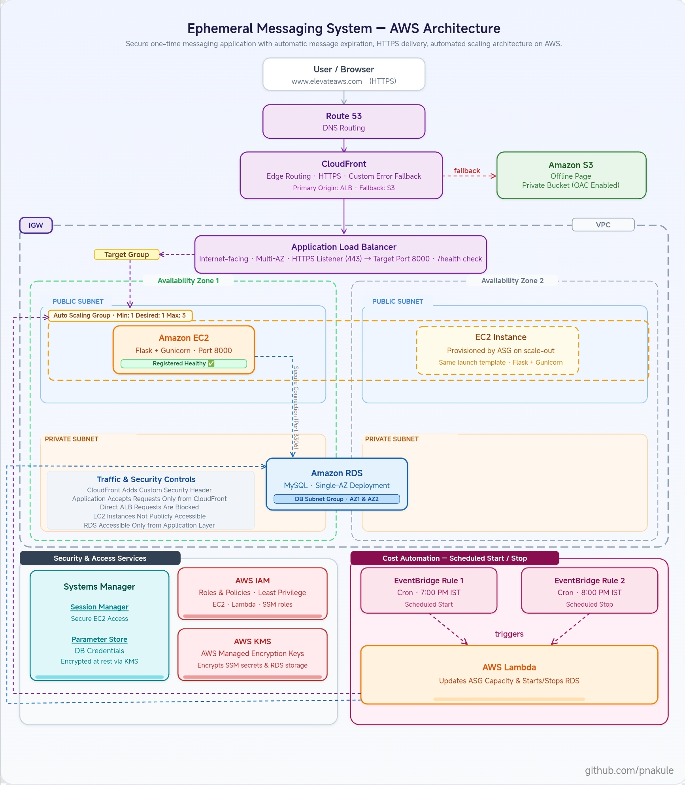

# Ephemeral Messaging System on AWS

## Overview

### Project Goals

- Understand how a real web application is deployed and works on AWS from start to end  
- Learn how scaling, security, HTTPS, failover, and automation work in cloud systems  
- Understand how different AWS services connect and work together  
- Learn AWS pricing and ways to reduce running cost 

This is a simple secure one-time messaging web application built on AWS.

Users can create secret messages, share links, and messages disappear after one view or expiration timeout.

> Important  
> To reduce AWS cost, this infrastructure runs only for 1 hour daily using EventBridge + Lambda automation.  
> Because of this, generated links may not work outside the scheduled runtime window.

---

## Architecture Diagram

---

## AWS Services Used

| Service | Used for |
|---|---|
| Route 53 | DNS routing |
| CloudFront | HTTPS delivery and failover,  Custom Security Header |
| ACM | SSL certificate |
| ALB | Traffic distribution to Healty Instances|
| Auto Scaling Group | EC2 scaling and self-healing |
| EC2 | Flask application hosting |
| RDS MySQL | Database |
| S3 | Offline/failover Static page |
| IAM | Secure service permissions and access control |
| Systems Manager | Secure EC2 access |
| Parameter Store | Store secrets and DB configs |
| Lambda | Infrastructure automation |
| EventBridge | Scheduled start/stop |

---

## Cost Breakdown (Estimated Monthly Cost for 30 Days)

> Note  
> These cost estimates are based on my current demo setup with assumed low traffic and limited daily runtime in the us-east-1 region.  
> Actual AWS cost may change depending on traffic, usage, and infrastructure changes.

---

### Application Load Balancer (ALB)

| Component | Estimated Monthly Cost |
|---|---|
| ALB Runtime (24/7 Running) | ~$16.20 |
| LCU Usage (Assumed Low Traffic) | ~$0.10–0.30 |
| Total Estimated Cost | ~$16–17/month |

> ALB remains active 24/7 and cannot be stopped like EC2 or RDS instances.

---

### Amazon EC2

| Component | Estimated Monthly Cost |
|---|---|
| t3.micro Runtime (1 Hour Daily) | ~$0.31 |
| 8 GiB gp3 Storage | ~$0.64 |
| Total Estimated Cost | ~$0.95/month |

> EC2 runtime cost is reduced using scheduled infrastructure automation.

---

### Amazon RDS (MySQL)

| Component | Estimated Monthly Cost |
|---|---|
| db.t4g.micro Runtime (1 Hour Daily) | ~$0.48 |
| gp3 Storage (20 GiB) | ~$2.30 |
| Automated Backups Disabled (Retention Period: 0) | $0 |
| Total Estimated Cost | ~$2.8/month |

> RDS storage charges continue even when the database instance is stopped.

---

### Amazon Route 53

| Component | Estimated Monthly Cost |
|---|---|
| Hosted Zone | ~$0.50 |
| DNS Queries (Very Low Usage) | ~$0 |
| Total Estimated Cost | ~$0.50/month |

---

> Other AWS services like S3, CloudFront, Lambda, and EventBridge currently generate very low cost due to low traffic and usage in this demo setup.

---

## Total Estimated Monthly Cost

| Setup | Estimated Monthly Cost |
|---|---|
| Complete Architecture | ~$20–22/month |

## Future Improvemts
- Add CI/CD pipeline to automatically deploy application updates from GitHub
- Add CloudWatch monitoring and alerts for infrastructure health and application logs
- Upgrade RDS to Multi-AZ deployment for higher availability
- Add AWS WAF for additional web application security

